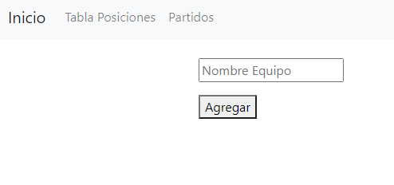
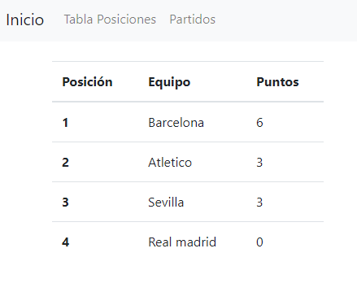
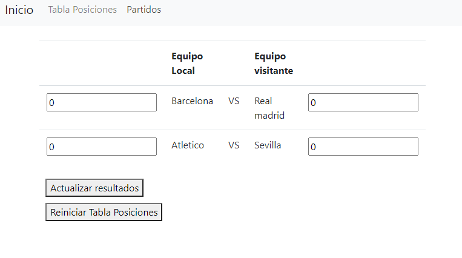

# Proyecto_OAS
Prueba técnica (Cuadrangular de fútbol)

# Descripcion 

El programa permite ingresar 4 equipos los cuales son almacenas en una base de datos junto con un puntaje inicial de cero, con los cuatro equipos ingresados se forma un cuadrangular donde se enfrenta equipo A con Equipo B y por otro lado equipo C con equipo D, el usuario puede ingresar los valores númericos del resultado del partido y al actualizar se genera una tabla de posiciones dependiendo al puntaje.

Para el proyecto se creó el servidor para las Rest API (rutas de la aplicación) el cual esta conectado a una base de datos Mysql, por medio de angular CLI se crea el frondend de la aplicación.

# Herramientas!
Para el desarrollo del proyecto se uso:
  - Base de datos : Xammp para el manejo de basesmySql
  - Angular cli 10.1
  - node.js 12.18.3
  - typescript
  - visual studio

# Ejecución

Para el poryecto se uso Xampp como gestor de la base de datos, se realiza primero la canexión con ella y posteriormente a creación de la base datos (se encuentra ubicada en la carpeta database del proyecto).

Opcionalemnte se puede usar los comandos "npm run build " y "npm run dev" en consolas diferentes, el primero para hacer la conversión de typescript a javascript y el segundo permite monitorar las peticiones al servidor.

Por defecto el servidor que une a la base de datos trabaja en el localhost:3000.

A continuación en una consola nueva ejecutar el servidor de nuestra página por medio del comando "ng serve" por defecto trabaja en el localhost:4200.

Realizado esto, la página debera presentar las siguiente  imagenes de cada uno de sus componentes: 

  - Inicio : componente donde se agrega el nombre de los equipos. 
  
    
     
  - Tabla de posiciones: componente donde se presentan los puntos y posiciones actuales de los 4 equipos.
  
    
    
  - Partidos: componente donde se presenta los enfretamiento y el usuario ingresa el resultado númerico de los goles de cada equipo. Además lo compone dos botones, Actualizar       Resultados (actualiza la tabla de posicion según los marcadores ingresado ) y Reiniciar tabla de posiciones( regresa a cero los puntos de todos los equipos)
  
    
    
   

